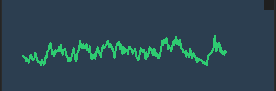
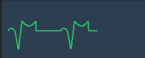
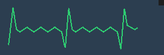

# 拆弹手册 (Defusal Manual)

> [!IMPORTANT]
> **致拆弹专家 (To the Expert):**
> 本手册用于指导你协助“拆弹者”解除炸弹。沟通是唯一的生存途径。
> 本游戏基本是沿用了 Keep Talking and Nobody Explodes 的规则 和设定，有兴趣的可以去看看原版。
---

## 炸弹基础结构 (Bomb Anatomy)

每一颗炸弹的外壳上都会贴有一张包含 6 位字母和数字的**序列号贴纸 (Serial Number)**。

许多复杂的拆弹模块都会依赖序列号的特定属性（例如：序列号的最后一位是奇数还是偶数？序列号的第一位数字是多少？）。
当你开始指导拆弹时，**请务必第一时间向拆弹者确认完整的序列号并记录下来**。

---

<div style="page-break-before:always;"></div>

## 1. 基础电线模块 (Wires)

> 经典桥段，不是吗？


炸弹上可能会出现一个包含 3 到 6 根电线的模块。这些电线的颜色可能是：红、蓝、黄、绿、白或黑。

**解题目标**：剪断唯一一根正确的电线。

**解题步骤**：
根据出现的电线数量（3 到 6 根），依次判断以下规则。执行你遇到的**第一个**符合条件的规则：

> [!TIP]
> **预备知识：**
> 如果规则提到了“序列号 (Serial Number)”，请向拆弹者确认炸弹外壳上显示的 6 位序列号。

### 3根电线：
1. 如果没有红线，剪断**第二根**电线。
2. 否则，如果最后一根是白线，剪断**最后一根**电线。
3. 否则，如果蓝线多于 1 根，剪断**最后一根蓝线**。
4. 否则，剪断**最后一根**电线。

### 4根电线：
1. 如果红线多于 1 根，**且**序列号的最后一位是奇数，剪断**最后一根红线**。
2. 否则，如果最后一根是黄线，**且**没有红线，剪断**第一根**电线。
3. 否则，如果恰好只有 1 根蓝线，剪断**第一根**电线。
4. 否则，如果黄线多于 1 根，剪断**最后一根**电线。
5. 否则，剪断**第二根**电线。

### 5根电线：
1. 如果最后一根是黑线，**且**序列号的最后一位是奇数，剪断**第四根**电线。
2. 否则，如果恰好有 1 根红线，**且**黄线多于 1 根，剪断**第一根**电线。
3. 否则，如果没有黑线，剪断**第二根**电线。
4. 否则，剪断**第一根**电线。

### 6根电线：
1. 如果没有黄线，**且**序列号的最后一位是奇数，剪断**第三根**电线。
2. 否则，如果恰好只有 1 根黄线，**且**白线多于 1 根，剪断**第四根**电线。
3. 否则，如果没有红线，剪断**最后一根**电线。
4. 否则，剪断**第四根**电线。

---
<div style="page-break-before:always;"></div>

## 2. 平衡模块 (Balance Module)
> 灵感来源于 《新警察故事里面》拆弹的场景也非常的老套
> 在键盘模式下，有可能会在完成其他谜题的同时再次激活此模块
> 要小心哦

此模块中心有一个红色的小球，它会不断试图逃离中心区域。

**解题目标**：将小球稳定在中心区域，并留意它随时可能重新启动的特性。

**解题步骤**：
> [!CAUTION]
> 倒计时开始后 3 秒，小球会随机向一个方向飞出！

1. 拆弹者需要使用键盘上的 `方向键` 或 `W A S D`（移动端推荐使用重力感应倾斜设备）控制小球的前进方向。
2. 只要小球碰到了黑色的边框边界，模块就会立即记一次 Strike（失误）。
3. **解除方法**：将小球控制在中心区域范围，当边框变绿后保持平稳 **1 秒钟**，模块即可（暂时）解除。
4. **⚠️高能注意**：当炸弹上的**其他任意模块**被解除时，此平衡模块将有 **33%** 的概率**重新启动**并进入倒计时！拆弹者必须全程提防它反复发作。

---

<div style="page-break-before:always;"></div>

## 3. 大按钮模块 (Press Module)
> 文字是可以骗人的

这个模块上只有一个巨大的圆形按钮。上面印有不同的字样，并且按钮本身也有不同的颜色。

**解题目标**：正确地“点按 (TAP)” 或 “长按 (HOLD)” 这个按钮。

**解题步骤**：
根据按钮的**颜色**和**字样**，执行你遇到的**第一个**符合条件的规则：

1. 如果按钮是**蓝色 (Blue)** ，且字样是 **"ABORT"** -> **长按 (HOLD)** 按钮。
2. 否则，如果字样是 **"DETONATE"** -> **点按 (TAP)** 按钮。
3. 否则，如果按钮是**白色 (White)** -> **长按 (HOLD)** 按钮。
4. 否则，如果按钮是**黄色 (Yellow)** -> **长按 (HOLD)** 按钮。
5. 否则，如果按钮是**红色 (Red)** ，且字样是 **"HOLD"** -> **点按 (TAP)** 按钮。
6. 否则 -> **长按 (HOLD)** 按钮。

### 长按释放规则 (Releasing a Held Button)
如果你被要求**长按 (HOLD)** 按钮，请按住它不要松开。
此时，按钮旁边会亮起一条**彩色光条 (Strip)**。你需要根据光条的颜色，在倒计时器显示特定数字时松手：

*   **蓝色 (Blue) 光条**：当倒计时器的任意位置含有数字 **4** 时松手。
*   **黄色 (Yellow) 光条**：当倒计时器的任意位置含有数字 **5** 时松手。
*   **其他任何颜色光条**：当倒计时器的任意位置含有数字 **1** 时松手。

> [!CAUTION]
> 点按 (TAP) 是指按下后立即松开（不超过 0.5 秒）。长按 (HOLD) 必须按住直到光条亮起！

---

<div style="page-break-before:always;"></div>

## 4. 符号键盘模块 (Keypad Module)
> 好好学外语吧，很有用的

**解题步骤**：
1. 查看下方的**符号列表**。
2. 找到**唯一**包含模块上所有 4 个符号的那一列。
3. 按照该列中**从上到下**的顺序，依次点击模块上的按钮。

**注意**：如果按错，模块会重置，你需要重新开始。

## 符号列表 (Symbol Lists)

|                                      列 1                                       |                   列 2                   |                   列 3                   |                   列 4                   |                   列 5                   |                   列 6                   |
| :-----------------------------------------------------------------------------: | :--------------------------------------: | :--------------------------------------: | :--------------------------------------: | :--------------------------------------: | :--------------------------------------: |
|                    <span style="font-size: 2.0em;">Ϙ</span>                     | <span style="font-size: 2.0em;">Ӭ</span> | <span style="font-size: 2.0em;">©</span> | <span style="font-size: 2.0em;">б</span> | <span style="font-size: 2.0em;">Ψ</span> | <span style="font-size: 2.0em;">б</span> |
| <span style="font-size: 2.0em; font-family: 'Segoe UI Symbol', serif;">Ѧ</span> | <span style="font-size: 2.0em;">Ϙ</span> | <span style="font-size: 2.0em;">Ͼ</span> | <span style="font-size: 2.0em;">¶</span> | <span style="font-size: 2.0em;">Δ</span> | <span style="font-size: 2.0em;">Ӭ</span> |
|                    <span style="font-size: 2.0em;">ƛ</span>                     | <span style="font-size: 2.0em;">Ͽ</span> | <span style="font-size: 2.0em;">Ҩ</span> | <span style="font-size: 2.0em;">Ѣ</span> | <span style="font-size: 2.0em;">Ѣ</span> | <span style="font-size: 2.0em;">҂</span> |
|                    <span style="font-size: 2.0em;">Ѣ</span>                     | <span style="font-size: 2.0em;">Ҩ</span> | <span style="font-size: 2.0em;">Ж</span> | <span style="font-size: 2.0em;">Ѭ</span> | <span style="font-size: 2.0em;">Ͼ</span> | <span style="font-size: 2.0em;">æ</span> |
|                    <span style="font-size: 2.0em;">Ѭ</span>                     | <span style="font-size: 2.0em;">☆</span> | <span style="font-size: 2.0em;">ƛ</span> | <span style="font-size: 2.0em;">Ж</span> | <span style="font-size: 2.0em;">¶</span> | <span style="font-size: 2.0em;">Ψ</span> |
|                    <span style="font-size: 2.0em;">ϗ</span>                     | <span style="font-size: 2.0em;">ϗ</span> | <span style="font-size: 2.0em;">Λ</span> | <span style="font-size: 2.0em;">¿</span> | <span style="font-size: 2.0em;">Ѯ</span> | <span style="font-size: 2.0em;">Ҋ</span> |
|                    <span style="font-size: 2.0em;">Ͽ</span>                     | <span style="font-size: 2.0em;">¿</span> | <span style="font-size: 2.0em;">☆</span> | <span style="font-size: 2.0em;">Δ</span> | <span style="font-size: 2.0em;">★</span> | <span style="font-size: 2.0em;">Ω</span> |

---

<div style="page-break-before:always;"></div>

## 5. 无线电对讲机 (Radio Module)
> 喂喂喂？信号不太好？

此模块模拟了一台老式无线电对讲机，上面有示波器波形图，以及两个可以滑动的调节器 (Tuner & Amp)。

**解题目标**：将频率 (Frequency) 和 振幅 (Amplitude) 调节到正确的值，然后按下 Transmit 发送信号。

**解题步骤**：
> [!TIP]
> **预备知识：**
> 你必须首先询问拆弹者炸弹外壳上的 **6 位序列号 (Serial Number)**。

1. **计算目标频率 (Target Frequency)**：
   * 读取序列号的**第一位字符**和**最后一位数字**。
   * 如果第一位字符是**数字**，其值即为该数字；如果是**字母**，将其转换为对应的字母表顺序（A=1, B=2, ..., Z=26）。
   * 目标频率 = `90.0 + 第一位字符的值 + 最后一位数字` (MHz)。
   * 例：如果序列号开头是 `C` (值为3)，结尾是 `9`，目标频率 = 90.0 + 3 + 9 = `102.0 MHz`。让拆弹者拨动上面那个长长的 Tuner 滑条，直到屏幕显示此频率。此时背景的静音电流声会变弱，会听到明显的正弦波蜂鸣声，且波形会相对稳定。
   
2. **计算目标振幅 (Target Amplitude)**：
   * 如果你刚计算出的目标频率 **小于 95.0 MHz**，目标振幅需要调到 **20**。
   * 如果你刚计算出的目标频率 **大于 100.0 MHz**，目标振幅需要调到 **80**。
   * **其他所有情况**，目标振幅需要调到 **50**。
   * 请让拆弹者拨动下方的 Amp 滑条调到对应数值。此时示波器上的波形高度会发生相应的变化。

3. 确认频率和振幅都正确后，按下 **TRANSMIT** 按钮。

---

<div style="page-break-before:always;"></div>

## 6. 医疗模块 (On-Call Module)
> 希望你不需要经历这些

本模块模拟医院值班场景。通过心电图 (ECG) 判断病情并给予治疗。

**操作步骤**：
1. 观察屏幕上的心电图波形。
2. 描述给专家，由专家查阅下表确定治疗方案。
3. 调整 **能量 (Joules)** 和 **剂量 (Dosage)** 滑条。
4. 点击 **ADMINISTER** 按钮。

### 值班手册 (On-Call Handbook)

| 波形 (Rhythm)       | 描述 (Description)                                      | 经典台词 (Treatment Logic)                              | 治疗方案 (Settings)                                              |
| :------------------ | :------------------------------------------------------ | :------------------------------------------------------ | :--------------------------------------------------------------- |
| **室颤 (V-Fib)**    | 混乱的波浪线，无规律。<br>Chaotic squiggles.            | "室颤了！全村吃饭！除颤！"<br>(It's a party! SHOCK IT!) | **Energy: ≥ 200 J**<br>**Dosage: 0 mg**                          |
| **停搏 (Asystole)** | 一条直线 (可能微动)。<br>Flat line.                     | "人没了，祈祷吧。"<br>(Do NOT shock. Pray.)             | **Energy: 0 J**<br>**Dosage: 0 mg**                              |
| **STEMI**           | 正常的波，但像墓碑一样高耸。<br>Tombstone ST-Elevation. | "寡妇制造者！送导管室！"<br>(To Cath Lab!)              | **Energy: 0 J**<br>**Dosage: 90 mg**<br>*(Door-to-Balloon Time)* |
| **房扑 (Flutter)**  | 锯齿状波形。<br>Sawtooth patter.                        | "教科书般的锯齿。给那个药！"<br>(Adenosine.)            | **Energy: 0 J**<br>**Dosage: 6 mg**                              |
| **窦性心动过速**    | 正常但很快 (>150)。<br>Fast regular beat.               | "紧张而已，出院。"                                      | **Energy: 0 J**<br>**Dosage: 0 mg**                              |

### 波形图鉴 (Waveform Reference)

#### 室颤 (V-Fib) 
*(混乱无序 Chaos)*


#### STEMI (墓碑 Tombstone)
*(高耸的ST段 High Arch)*


#### 房扑 (Flutter)
*(锯齿状 Sawtooth)*


---

<div style="page-break-before:always;"></div>

## 7. 盲点迷宫 (Blind Maze)
> 相信我，我在哪

此模块中，拆弹者**完全看不到迷宫的墙壁**，只能看到自己（**红点**）和出口（**绿点**，仅距离 ≤ 3 格时可见）。你必须通过语言导航，指挥拆弹者走出迷宫。

**解题目标**：引导拆弹者从起点走到终点并确认到达。

**解题步骤**：

**完整模式**：系统会从以下 10 个固定迷宫中随机选择一个。

**重要**：首先让拆弹者报告初始位置（**红点**坐标），然后对照下表找到对应的迷宫地图。

所有迷宫均为 **6×6 网格**，坐标从左上角 (0,0) 到右下角 (5,5)。

#### 迷宫地图 #1（起点 1,1 → 出口 4,4）难度：简单
```
┌───┬───┬───┬───┬───┬───┐
│ █ │ █ │ █ │ █ │ █ │ █ │
│ █ │ S │   │   │ █ │ █ │  第1行
│ █ │   │ █ │   │   │ █ │  第2行
│ █ │   │ █ │ █ │   │ █ │  第3行
│ █ │   │   │   │ E │ █ │  第4行 (E=4,4)
│ █ │ █ │ █ │ █ │ █ │ █ │
└───┴───┴───┴───┴───┴───┘
  0   1   2   3   4   5

最短路径 (6步): 东→东→南→东→南→南
```

#### 迷宫地图 #2（起点 1,1 → 出口 4,4）难度：中等
```
┌───┬───┬───┬───┬───┬───┐
│ █ │ █ │ █ │ █ │ █ │ █ │
│ █ │ S │   │ █ │   │ █ │  第1行
│ █ │ █ │   │   │   │ █ │  第2行
│ █ │   │   │ █ │   │ █ │  第3行
│ █ │   │ █ │   │ E │ █ │  第4行 (E=4,4)
│ █ │ █ │ █ │ █ │ █ │ █ │
└───┴───┴───┴───┴───┴───┘

最短路径 (6步): 东→南→东→东→南→南
```

#### 迷宫地图 #3（起点 1,1 → 出口 4,4）难度：中等
```
┌───┬───┬───┬───┬───┬───┐
│ █ │ █ │ █ │ █ │ █ │ █ │
│ █ │ S │ █ │   │   │ █ │  第1行
│ █ │   │   │   │ █ │ █ │  第2行
│ █ │ █ │   │ █ │   │ █ │  第3行
│ █ │   │   │   │ E │ █ │  第4行 (E=4,4)
│ █ │ █ │ █ │ █ │ █ │ █ │
└───┴───┴───┴───┴───┴───┘

最短路径 (6步): 南→东→南→南→东→东
```

#### 迷宫地图 #4（起点 1,1 → 出口 4,4）难度：中等
```
┌───┬───┬───┬───┬───┬───┐
│ █ │ █ │ █ │ █ │ █ │ █ │
│ █ │ S │   │   │ █ │ █ │  第1行
│ █ │ █ │ █ │   │   │ █ │  第2行
│ █ │   │   │   │ █ │ █ │  第3行
│ █ │   │ █ │   │ E │ █ │  第4行 (E=4,4)
│ █ │ █ │ █ │ █ │ █ │ █ │
└───┴───┴───┴───┴───┴───┘

最短路径 (6步): 东→东→南→南→南→东
```

#### 迷宫地图 #5（起点 1,1 → 出口 4,4）难度：困难
```
┌───┬───┬───┬───┬───┬───┐
│ █ │ █ │ █ │ █ │ █ │ █ │
│ █ │ S │   │ █ │   │ █ │  第1行
│ █ │   │ █ │   │   │ █ │  第2行
│ █ │   │   │   │ █ │ █ │  第3行
│ █ │ █ │   │   │ E │ █ │  第4行 (E=4,4)
│ █ │ █ │ █ │ █ │ █ │ █ │
└───┴───┴───┴───┴───┴───┘

最短路径 (6步): 南→南→东→东→南→东
```

#### 迷宫地图 #6（起点 1,1 → 出口 4,4）难度：困难
```
┌───┬───┬───┬───┬───┬───┐
│ █ │ █ │ █ │ █ │ █ │ █ │
│ █ │ S │   │   │   │ █ │  第1行
│ █ │ █ │   │ █ │   │ █ │  第2行
│ █ │   │   │   │ █ │ █ │  第3行
│ █ │   │ █ │   │ E │ █ │  第4行 (E=4,4)
│ █ │ █ │ █ │ █ │ █ │ █ │
└───┴───┴───┴───┴───┴───┘

最短路径 (6步): 东→南→南→东→南→东
```

#### 迷宫地图 #7（起点 1,1 → 出口 4,4）难度：中等
```
┌───┬───┬───┬───┬───┬───┐
│ █ │ █ │ █ │ █ │ █ │ █ │
│ █ │ S │   │ █ │   │ █ │  第1行
│ █ │ █ │   │   │   │ █ │  第2行
│ █ │   │   │ █ │   │ █ │  第3行
│ █ │   │ █ │   │ E │ █ │  第4行 (E=4,4)
│ █ │ █ │ █ │ █ │ █ │ █ │
└───┴───┴───┴───┴───┴───┘

最短路径 (6步): 东→南→东→东→南→南
```

#### 迷宫地图 #8（起点 2,1 → 出口 4,4）难度：困难
```
┌───┬───┬───┬───┬───┬───┐
│ █ │ █ │ █ │ █ │ █ │ █ │
│ █ │   │ S │   │   │ █ │  第1行 (S=2,1)
│ █ │   │   │   │ █ │ █ │  第2行
│ █ │ █ │   │   │   │ █ │  第3行
│ █ │   │   │ █ │ E │ █ │  第4行 (E=4,4)
│ █ │ █ │ █ │ █ │ █ │ █ │
└───┴───┴───┴───┴───┴───┘
  0   1   2   3   4   5

最短路径 (5步): 东→南→南→东→南
注意：起点在(2,1)，不在角落！
```

#### 迷宫地图 #9（起点 1,1 → 出口 4,4）难度：专家
```
┌───┬───┬───┬───┬───┬───┐
│ █ │ █ │ █ │ █ │ █ │ █ │
│ █ │ S │   │   │ █ │ █ │  第1行
│ █ │   │ █ │   │ █ │ █ │  第2行
│ █ │   │   │   │   │ █ │  第3行
│ █ │ █ │ █ │   │ E │ █ │  第4行 (E=4,4)
│ █ │ █ │ █ │ █ │ █ │ █ │
└───┴───┴───┴───┴───┴───┘

最短路径 (6步): 东→东→南→南→东→南
```

#### 迷宫地图 #10（起点 1,1 → 出口 4,4）难度：困难
```
┌───┬───┬───┬───┬───┬───┐
│ █ │ █ │ █ │ █ │ █ │ █ │
│ █ │ S │   │ █ │   │ █ │  第1行
│ █ │ █ │   │   │ █ │ █ │  第2行
│ █ │   │   │   │   │ █ │  第3行
│ █ │   │ █ │ █ │ E │ █ │  第4行 (E=4,4)
│ █ │ █ │ █ │ █ │ █ │ █ │
└───┴───┴───┴───┴───┴───┘

最短路径 (6步): 东→南→东→南→东→南
```

> [!TIP]
> **快速识别迷宫**：
> 1. 让拆弹者报告起点坐标（通常是1,1，但地图#8是2,1）
> 2. 让拆弹者尝试移动一步，报告撞墙或成功
> 3. 根据初始可移动方向快速缩小范围

> [!CAUTION]
> **常见错误**：
> *   拆弹者走偏后没有及时利用撞墙（边框红色闪烁）重新校准位置。
> *   距离出口太远时看不到绿点，需要靠迷宫地图和步数估算。

### 第三阶段：确认到达
当拆弹者的**红点**和**绿点**重叠时，让拆弹者点击 **「确认到达」** 按钮。

*   如果位置正确 → 模块解除。
*   如果位置错误（未到达出口）→ 触发失误。

---

### 专家提示
*   **让拆弹者边走边报告**：每走一步都说"走了"，这样你可以跟踪位置。
*   **撞墙有红色闪烁**：拆弹者撞墙时屏幕边框会红色闪烁，可以用来校准当前位置。
*   **出口可见范围**：只有在距离出口 3 格以内时，**绿点**才会显示。在此之前只能靠迷宫地图导航。
