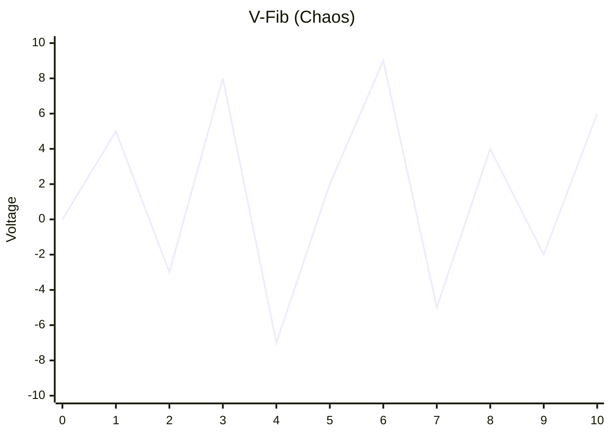
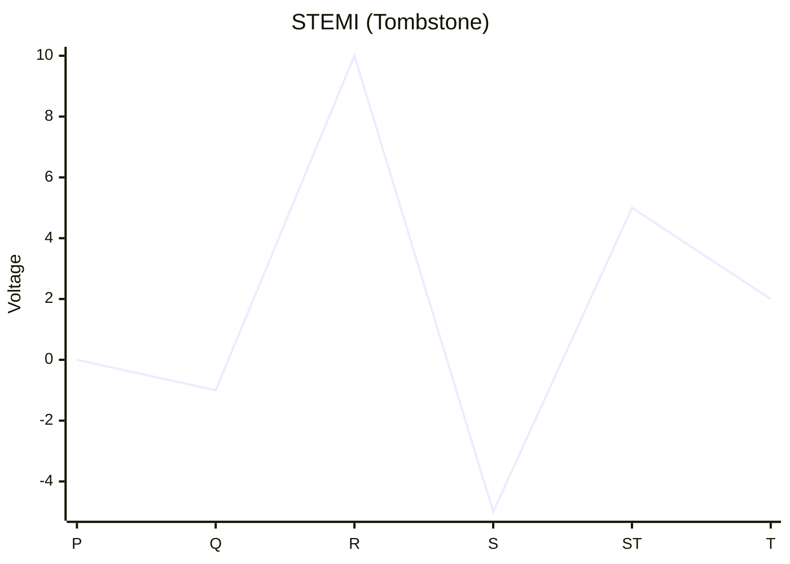

# 拆弹手册 (Gamed Manual)

## 按钮模块 (Button Module)

此模块由 4 个带有奇怪符号的按钮组成。

**解题目标**：按正确的顺序点击这 4 个按钮。

**解题步骤**：
1. 查看下方的**符号列表**。
2. 找到**唯一**包含模块上所有 4 个符号的那一列。
3. 按照该列中**从上到下**的顺序，依次点击模块上的按钮。

**注意**：如果按错，模块会重置，你需要重新开始。

### 符号列表 (Symbol Lists)

| 列 1 | 列 2 | 列 3 | 列 4 | 列 5 | 列 6 |
| :---: | :---: | :---: | :---: | :---: | :---: |
| Ϙ | Ӭ | © | б | Ψ | б |
| Ѧ | Ϙ | Ѽ | ¶ | ツ | Ӭ |
| ƛ | Ͽ | Ҩ | Ѣ | Ѣ | ҂ |
| Ϟ | Ҩ | Ж | Ѭ | Ͼ | æ |
| Ѭ | ☆ | ƛ | Ж | ¶ | Ψ |
| ϗ | ϗ | ㄓ | ¿ | Ѯ | Ҋ |
| Ͽ | ¿ | ☆ | ツ | ★ | Ω |

---

## 医疗模块 (On-Call Module)

本模块模拟医院值班场景。通过心电图 (ECG) 判断病情并给予治疗。

**操作步骤**：
1. 观察屏幕上的心电图波形。
2. 描述给专家，由专家查阅下表确定治疗方案。
3. 调整 **能量 (Joules)** 和 **剂量 (Dosage)** 滑条。
4. 点击 **ADMINISTER** 按钮。

### 值班手册 (On-Call Handbook)

| 波形 (Rhythm) | 描述 (Description) | 经典台词 (Treatment Logic) | 治疗方案 (Settings) |
| :--- | :--- | :--- | :--- |
| **室颤 (V-Fib)** | 混乱的波浪线，无规律。<br>Chaotic squiggles. | "室颤了！全村吃饭！除颤！"<br>(It's a party! SHOCK IT!) | **Energy: ≥ 200 J**<br>**Dosage: 0 mg** |
| **停搏 (Asystole)** | 一条直线 (可能微动)。<br>Flat line. | "人没了，祈祷吧。"<br>(Do NOT shock. Pray.) | **Energy: 0 J**<br>**Dosage: 0 mg** |
| **STEMI** | 正常的波，但像墓碑一样高耸。<br>Tombstone ST-Elevation. | "寡妇制造者！送导管室！"<br>(To Cath Lab!) | **Energy: 0 J**<br>**Dosage: 90 mg**<br>*(Door-to-Balloon Time)* |
| **房扑 (Flutter)** | 锯齿状波形。<br>Sawtooth patter. | "教科书般的锯齿。给那个药！"<br>(Adenosine.) | **Energy: 0 J**<br>**Dosage: 6 mg** |
| **窦性心动过速** | 正常但很快 (>150)。<br>Fast regular beat. | "紧张而已，出院。" | **Energy: 0 J**<br>**Dosage: 0 mg** |

### 波形图鉴 (Waveform Reference)

#### 室颤 (V-Fib) 
*(混乱无序 Chaos)*


#### STEMI (墓碑 Tombstone)
*(高耸的ST段 High Arch)*


#### 房扑 (Flutter)
*(锯齿状 Sawtooth)*
```mermaid
xychart-beta
    title "Flutter (Sawtooth)"
    x-axis [F, F, F, QRS, F, F]
    y-axis "Voltage" -5 --> 10
    line [2, -2, 2, 8, 2, -2]
```
